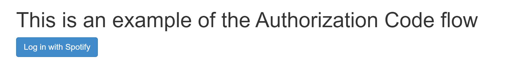

# API @cmda-minor-web 2023 - 2024


## Inhoudsopgave
- [De opdracht](#de-opdracht)
- [Installatie](#installatie)
  - [Localhost](#localhost)
  - [Publiekelijk toegankelijk](#publiekelijk-toegankelijk)
    - [NPM Module - Localtunnel](#npm-module---localtunnel)
    - [Apache2 i.c.m. Nginx Proxy Manager](#apache2-icm-nginx-proxy-manager)
- [Gebruikte API's](#gebruikte-apis)
  - [Spotify API](#spotify-api)
  - [Web API: Notification](#web-api-notification)
- [Schetsen / Prototypes](#schetsen--prototypes)
  - [Schetsen](#schetsen)
    - [Homepage](#homepage)
    - [Playlist](#playlist)
    - [Track/playlist banners](#trackplaylist-banners)
  - [Authenticatie](#authenticatie)
  - [Player](#player)
- [Eindresultaat](#eindresultaat)
- [Reflectie](#reflectie)
- [Logs](#logs)

## De opdracht
De opdracht voor het vak API ging over het leren gebruik maken van externe API's en het hosten van een back-end server a.d.h.v. NodeJS. Als API heb ik de API van Spotify gekozen, omdat ik hier graag meer over wilde leren en omdat ik graag een media player wilde maken dat daadwerkelijk functioneert als media player. 

De opdracht voor het vak API luidt als volgt; *"In dit vak zullen we een van de meest voorkomende app-concepten van vandaag gebruiken en ontdekken dat we deze kunnen maken met moderne webtechnologie."*. Het app-concept dat ik heb gekozen is Spotify, wat als streamingsdienst wordt beschouwd. Dit app-concept bestaat uit meerdere API's, waarvan ik de *Web API* en *Web Playback SDK* heb gebruikt. Deze twee zijn als enige relevant voor een media player op het web. De API's van dit app-concept is naar mijn mening uiteindelijk vrij gemakkelijk te gebruiken, alleen is de opstap naar het begrijpen van de API's erg lastig. Gelukkig biedt Spotify een uitgebreide documentatie over de [Web API](https://developer.spotify.com/documentation/web-api) en de [Web Playback SDK](https://developer.spotify.com/documentation/web-playback-sdk).

De doelen van dit vak zijn gericht op 'het in staat zijn om een server-side gerenderde applicatie te maken, het in staat zijn om een enerverende gebruikerservaring te creëren en een breder begrip te krijgen van het web en zijn mogelijkheden'. Naar mijn mening lag de focus vooral op het maken van een server-side gerenderde applicatie, omdat dit voor de meesten een vrij nieuw iets is en velen tegen problemen met de server-side aanliepen gedurende het vak. Voor de server-side gerenderde applicatie moest als back-end NodeJS gebruikt worden, maar waren we vrij in het kiezen van modules die we wilde toevoegen aan NodeJS, zoals de module om HTML pagina's te renderen of de module om een server app op te starten. Ik heb gekozen om **LiquidJS** te gebruiken als renderer en **Tinyhttp** om een server app te maken dat wordt gehost met NodeJS/Nodemon. LiquidJS lijkt heel erg op een module die ik al eens eerder heb gebruikt om dynamische websites te maken, namelijk **Flask**. Flask is een Python module die precies dezelfde layout kent als LiquidJS, alleen is LiquidJS natuurlijk alleen voor JavaScript beschikbaar en omdat ik toch mijn JavaScript skills wilde verbeteren, heb ik ervoor gekozen om LiquidJS te leren i.p.v. dat ik iets ging gebruiken dat ik al kende. Tinyhttp is een alternatief voor Express, maar dan helemaal kaal getrokken, wat een flinke performance boost oplevert. Tinyhttp kent enkele modules die erbij geïnstalleerd kunnen worden, maar voor sommige functionaleiten moet een extra framework worden gebruikt, zoals voor het renderen van static files. Hiervoor kent Tinyhttp geen extra module en moest ik gebruik gaan maken van *serveStatic*

Het was ook de bedoeling dat we ons bezig gingen houden met Enhancements voor het app-concept door bijvoorbeeld gebruik te maken van extra *Web API's*. Hiervoor heb ik gekozen om de Web API [**Notification**](https://developer.mozilla.org/en-US/docs/Web/API/Notification) te gebruiken, waarmee ik een notificatie genereer wanneer er een nieuw liedje wordt afgespeeld. Maar ook het visueel aantrekkelijk maken van de site was belangrijk. In mijn geval heb ik het design van Spotify een beetje nagemaakt, zodat het net lijkt alsof er gebruik wordt gemaakt van Spotify.

## Installatie
Om Dopify te gebruiken zijn er twee manieren waarop de server gehost kan worden; alleen op localhost of publiekelijk toegankelijk. Voor de localhost versie zal Dopify alleen toegankelijk zijn op een browser van de host zelf. Als Dopify publiekelijk toegankelijk is kan logische wijs iedereen bij de site komen. Het publiekelijk toegankelijk maken van de site kan op twee manieren; via het internet d.m.v. een NPM module genaamd Localtunnel of, zoals ik het heb gedaan, a.d.h.v. Apache2 en Nginx Proxy Manager, maar dit kan natuurlijk op ieders eigen manier. Standaard is het alleen mogelijk om met je eigen account gebruik te maken van de Spotify App, maar er kunnen wel 'leden' worden toegevoegd aan de app met een maximum van 25 leden. Om een lid toe te voegen moet je op het dashboard van de app onder *users* de naam van het lid en het e-mailadres van het lid invoeren. 

### Localhost
De repository is vrijwel 'ready to use'. De enige vereiste software-componenten voor de installatie van Dopify zijn NodeJS en NPM. Optioneel is Nodemon dat globaal geïnstalleerd is, maar dat wordt meer gebruikt voor testdoeleindes. Eerst moet natuurlijk de repository geclonned worden. Het enige dat mist aan de repository is een access token en een secret token, die app gebonden zijn. Lees de informatie door van de volgende [link](https://developer.spotify.com/documentation/web-api/tutorials/code-flow) voor meer informatie. Deze dienen in een file gezet te worden genaamd *token.env*, dat natuurlijk niet is meegegeven aan de repository. De structuur van de file ziet er als volgt uit:

```
client_id= { access token v/d app }
client_secret= { secret token v/d app }
```

Vervolgens dienen er een aantal dingen te worden aangepast in twee files, namelijk *server.js* en *index.liquid*. *server.js* bevat een redirect URL dat gelijk moet zijn aan de ingestelde redirect URL in de Spotify app. Het gaat om de waarde van **redirect_uri**, dat te vinden is in regel 23. *index.liquid* bevat meerdere 'buttons' (aria labels) die ieder een href bevatten die de gebruiker ergens naar toe door verwijzen. Het is van belang dat het path onaangepast blijft, alleen de domeinnaam moet gewijzigd worden. Het gaat om de regels *15*, *20* en *21*.

Als de hierboven genoemde stappen zijn uitgevoerd, kan de installatie beginnen. Wanneer zowel NodeJS als NPM aanwezig zijn op het systeem, kan Dopify worden geïnstalleerd door het volgende commando te runnen in de folder van de cloned repository.

```
npm install
```

Vervolgens wordt de server opgestart door één van de volgende commando's uit te voeren in de folder genaamd Dopify.

```
--- NODE ---
node server.js

--- NODEMON ---
nodemon server.js
```

De server zal nu zonder problemen worden uitgevoerd. 

### Publiekelijk toegankelijk
Om de server publiekelijk toegankelijk te maken, is het vereist dat er gebruik wordt gemaakt van HTTPS. Zonder HTTPS zal de Spotify API errors geven en niet functioneren, omdat zij willen dat er gebruik wordt gemaakt van HTTPS. Voor localhost maakt het niet uit. Er zijn twee manieren, de simpele manier waarbij gebruik wordt gemaakt van een NPM-module en de ingewikkelde manier. De laatste methode heb ik gebruikt om [Dopify](https://dopify-player.nl) te hosten. 

*Note: Voor het publiekelijk toegankelijk maken van de site volgens de volgende twee methodes moeten de stappen voor het uitvoeren van de server op localhost worden doorlopen.*

#### NPM-module - localtunnel
<details>
<summary><u><b>Klap de tekst open...</b></u></summary>
**localtunnel** is een NPM module dat het HTTP verkeer van localhost doorstuurt naar een server van localtunnel, dat dient als HTTPS proxy. Het is namelijk onmogelijk om met *tinyhttp* gebruik te kunnen maken van SSL certificaten om HTTPS te verkrijgen op de website. Om localtunnel te installeren is het vereist om deze global te installeren, om de tool zo goed mogelijk te laten functioneren.

```
npm install -g localtunnel
```

Vervolgens moet de webserver (nodeJS of nodemon) worden gestart in een terminal, waarna er in een andere terminal het volgende commando wordt uitgevoerd.

```
lt --port { poortnummer v/d server (standaard 8500) }
```

Nu zal *localtunnel* een URL genereren, die de website met HTTPS zal weergeven aan de gebruiker dat de URL bezoekt. Let wel op, de URL is beveiligd met een wachtwoord. Het wachtwoord is het publieke [IP](https://www.whatsmyip.org/) van het systeem waar de webserver op wordt uitgevoerd.
</details>

#### Apache2 i.c.m. Nginx Proxy Manager
<details>
<summary><u><b>Klap de tekst open...</b></u></summary>

**Apache2** kan voor meerdere doeleindes worden gebruikt, zoals het hosten van een simpele website. Maar dankzij de talloze beschikbare modules kan Apache2 ook worden gebruikt als HTTPS Proxy. Apache2 dient in mijn geval als Proxy voor de NodeJS server dat draait op HTTP. De proxy zorgt ervoor dat de buiten wereld denkt een HTTPS-verbinding te hebben met de webserver en dat is voor het grootste gedeelte ook zo. Het verkeer is alleen geen HTTPS-verkeer als het vanaf de proxy naar de NodeJS webserver gaat, maar als beide services op dezelfde host worden uitgevoerd, zal het geen beveiligings-risico's met zich meebrengen. Om Apache2 te installeren moet het volgende commando worden uitgevoerd:

```
apt-get install apache2 -y
```

Apache2 heeft een configuratie file nodig om te kunnen functioneren. Hiervoor stel ik de volgende template beschikbaar (alles tussen {} moet worden ingevuld):
<details>
<summary><u><b>Klap de tekst open...</b></u></summary>

```
NameVirtualHost *:443
<VirtualHost *:443>
  ServerName { domeinnaam }
  DocumentRoot { path naar bestanden voor de website, niet zo relevant }

  CustomLog <LOG-PATH> combined
  ErrorLog <ERROR-LOG-PATH>

  # Example SSL configuration
  SSLEngine on
  SSLProtocol all -SSLv2
  SSLCipherSuite HIGH:MEDIUM:!aNULL:!MD5
  SSLCertificateFile "{ path naar HTTPS certificaat }"
  SSLCertificateKeyFile "{ path naar private key file }"
  SSLCACertificateFile "{ path naar chain file }"

  ProxyPass / http://0.0.0.0:{ poortnummer }/
  ProxyPassReverse / http://0.0.0.0:{ poortnummer }/
</VirtualHost>
```

</details>

Dit configuratie bestand moet worden geplaatst op het pad */etc/apache2/sites-available/{ naam }.conf*. Om Apache2 te laten werken met dit configuratie bestand moeten de modules *ssl*, *proxy* en *proxy_http* worden geïnstalleerd en moet de configuratie file zelf worden geactiveerd. 
```
a2ensite { path naar configuratie file }
a2enmod ssl
a2enmod proxy
a2enmod proxy_http
```

Nu is het nog niet klaar; de **Nginx Proxy Manager** moet nog worden geïnstalleerd en geconfigureerd. *Nginx Proxy Manager* wordt in mijn geval gebruikt om inkomende verkeer op te vangen en door te verwijzen naar de juiste host. Dit, omdat ik meerdere sites host op één publiek IP, waardoor ik een tool nodig heb dat het verkeer voor verschillende domeinen van elkaar kan scheiden. Daarvoor komt Nginx Proxy Manager van pas. Deze tool kijkt namelijk in de header van elk web pakketje, waar als eindbestemming het bezochte URL met daarin het bijbehorende domeinnaam staat vermeld. Door *Proxy Hosts* in te stellen weet Nginx waar bepaald verkeer heen moet. Ook kan de tool SSL certificaten voor een domein aanmaken a.d.h.v. Let's Encrypt. Maar eerst de installatie van Nginx Proxy Manager.

De tool werkt op basis van Docker, een applicatie waarmee simpele Virtuele Containers gehost kunnen worden. Virtuele Containers zijn als het ware mini-computers die elk een eigen doeleind hebben/service zijn, maar dan virtueel. Mijn advies is om de guide van [Nginx Proxy Manager](https://nginxproxymanager.com/guide/#hosting-your-home-network) zelf te volgen voor de installatie van Docker en Nginx Proxy Manager. Een tip is wel om versie 2.10.4 van Ngin Proxy Manager te gebruiken, omdat er bugs in de meest recente versie zitten.

Na de installatie en configuratie van Nginx Proxy Manager kan er een SSL certificaat worden gegenereerd door te navigeren naar *SSL Certificates* in de navigatiebalk, om vervolgens op de knop **Add SSL Certificate** te drukken. Het volgende dialoog verschijnt, waarin de velden *Domain Names* en *Email Address for Let's Encrypt* moeten worden ingevuld.


Als het SSL certificaat is aangemaakt kan de Proxy Host worden geconfigureerd voor de webserver. Hiervoor moet er in de navigatiebalk naar *Hosts* worden genavigeerd, wat een dropdown menu opent wanneer er op de knop wordt gedrukt. Vervolgens moet er naar *Proxy Hosts* worden genavigeerd, om daarna op de knop **Add Proxy Host** te drukken. Het volgende dialoog verschijnt, waarin in het kopje **Details** de velden *Domain Names*, *Forward Hostname / IP* en *Forward Port* moeten worden ingevuld en in het kopje **SSL** het aangemaakt certificaat onder *SSL Certificate* en *Force SSL* moeten worden geselecteerd.


Nu de Proxy Host is aangemaakt, moet het SSL certificaat worden geëxporteerd en moeten de bestanden *cert1.pem*, *chain1.pem* en *privkey1.pem* op de host worden gezet waar de Apache2 service op draait, om zo de bestanden te gebruiken voor de SSL configuratie. Als alle stappen zijn doorlopen moet de Apache2 server worden herstart a.d.h.v. het volgende commando en, als deze dat nog niet is, moet de NodeJS server worden gestart.

```
systemctl restart apache2
```
</details>

 
## Gebruikte API's
De API dat ik heb gebruikt voor de opdracht is de API van Spotify. Spotify stelt vrijwel hun hele assortiment van API's beschikbaar voor Premium gebruikers om te gebruiken als Developer. Hiervoor heb ik in de Developer Panel een app aangemaakt, die ik de naam Dopify heb gegeven. Op het moment kon ik geen andere naam bedenken en ik heb de naam van mijn tool simpelweg zo gelaten. 

### Spotify API
Ik ben begonnen met het uitproberen van verschillende functionaliteiten van de Spotify API, waarbij ik vooraf kort onderzoek heb gedaan over wat er überhaupt mogelijk is met de API. Al snel kwam ik erachter dat mijn denkwijze over hoe Spotify werkt niet klopte. Ik had namelijk het idee dat Spotify als media player functioneerde en telkens het nummer dat werd afgespeeld vooraf ophaalde en dat de media controls, zoals de knoppen om te pauzeren, het liedje te skippen, etc., in de applicatie werden uitgevoerd. Maar eigenlijk werkt alles in Spotify, zowel de web versie als alle applicaties die op apparaten kan worden gedownload, a.d.h.v. API calls naar de servers van Spotify, vanuit waar de muziek wordt gestreamed naar het afspeelapparaat. 

Toen ik dit eenmaal doorhad, begon ik de werking van de Spotify API beter te begrijpen en vond ik het makkelijker om er gebruik van te maken.

### Web API: Notification
Als extra web API heb ik gebruik gemaakt van Notifications. Ik heb dit gebruikt om een browser notificatie te tonen wanneer er een nieuw nummer wordt afgespeeld. Hierdoor hoeft een gebruiker van Dopify niet de player constant open te hebben om te zien wat er afspeelt, gezien er vanuit het OS een notificatie wordt getoond. Zelf heb ik geconstateerd dat de notificaties op MacOS te kaal zijn om te kunnen gebruiken, maar op Windows wordt er in een Chromium browser netjes de notificatie getoond.

## Schetsen / Prototypes
Voor deze opdracht heb ik 4 schetsen gemaakt, waarvan er drie zijn uitgewerkt in het uiteindelijke product. Naast de schetsen heb ik twee verschillende 'prototypes'; één prototype voor de authenticatie via de Spotify Authenticatie API en één voor de Spotify Web Playback SDK API. De functionaliteiten van deze twee prototypes zijn uitgewerkt in het uiteindelijke product.

### Schetsen
#### Homepage
Voor de hoofdpagina heb ik twee schetsen; één met de uitgeklapte wachtrij en één zonder. 


#### Playlist
Ik heb een schets gemaakt van een geopende playlist, waarin gescrolled kan worden en elk liedje in de playlist individueel getoond wordt met de bijbehorende informatie, zoals titel van het liedje, het album vanuit waar het liedje afkomstig is, de datum waarop het liedje aan de afspeellijst is toegevoegd, het tempo van het liedje in BPM en de duratie van het liedje.


#### Track/Playlist banners
Op de hoofdpagina wil ik elke track/playlist weergeven a.d.h.v. een banner, zoals ook te zien is in Spotify zelf.


### Authenticatie
Ik begon te experimenteren van de functionaliteiten voor de Spotify authenticatie. Hiervoor volgde ik een [guide](https://developer.spotify.com/documentation/web-api/howtos/web-app-profile) van Spotify zelf. Het resultaat was er, maar ik snapte nog niet helemaal hoe dit in zijn werking ging. Dus besloot ik om naar de verschillende concepten voor de authenticatie te kijken, die wederom van Spotify zelf waren. Het resultaat was een prototype voor de authenticatie van Spotify.




De authenticatie van gebruikers verloopt via de server-side, die het verzoek naar de authenticatie API van Spotify een verzoek stuurt. In het verzoek wordt de gebruiker doorverwezen naar een inlogpagina van Spotify zelf, waarin de gebruiker akkoord moet geven op punten die vooraf zijn ingesteld. Als de gebruiker eenmaal ingelogd is, zal de authenticatie API van Spotify een POST response sturen om aan de server door te geven dat de gebruiker geauthentiseerd is. In de response staat een *Access Token* en een *Refresh Token*. Met de Refresh Token kan de server verzoeken naar een API van Spotify sturen namens een ingelogde gebruiker door de access token in de header mee te geven in het verzoek. De Access Token is maar één uur geldig en om deze te vernieuwen is de Refresh Token nodig. 

In de tweede afbeelding van de bovenstaande afbeeldingen is informatie te zien over mijn Spotify account. Dit is informatie dat uit een response van een request dat naar Spotify is gestuurd. In de request staat een URL gespecificeerd, vanuit waar de API a.d.h.v. de Access Token informatie terug stuurt dat Spotify publiekelijk beschikbaar stelt, zoals de display name, id, spotify URI, Profile Image en het land waar het account in is gevestigd.

### Player
Na de authenticatie enigzins te begrijpen begon ik te rommelen met de *Web Playback SDK*, oftewel, de Spotify Player API. In deze API zijn alle functionaliteiten te vinden die te maken hebben met de player, zoals het starten/pauzeren van liedjes, een vorig/volgend liedje afspelen, volume van de player, de positie in het afspelende liedje, etc. Deze API is, logische wijze, alleen via de client-side te gebruiken. Een server kan immers geen media player weergeven. Om deze reden heb ik de deze API eerst apart, lokaal getest zonder dat ik een server-side gerenderde applicatie aan het uitvoeren was. Hiermee heb ik het volgende prototype tot stand kunnen brengen.


In het prototype heb ik enkele functionaliteiten van de Spotify Player verwerkt, zoals de toggle play, pause, resume, next en previous knoppen, een werkende volume en seek (door het liedje zoeken) slider en enkele gegevens over een liedje dat aan het afspelen is, zoals de album cover, de artiest en de titel van het liedje. De knoppen werken op basis van een aangeleverde functie genaamd *player*, waarmee functies kunnen worden gemaakt die een commando versturen naar de Spotify Player API. Deze functies kunnen a.d.h.v. een onClick button worden aangeroepen. Dit zijn alleen vrij simpele functies, omdat alle code voor een bepaalde functionaliteit al door Spotify is gemaakt en wordt aangeleverd. Alleen de sliders heb ik zelf bedacht. Deze werken op basis van een script dat door *Sanne 't Hoofd* is aangeleverd voor een ander vak, waarbij de sliders een bepaalde value krijgen op een bepaalde positie. Deze value is ligt tussen de 0 en 1, om 0% en 100% aan te duiden. Vervolgens wordt deze value omgezet naar een **CSS root** waarde, wat weer in het JavaScript script wordt gebruikt om de volume en seek waarde te vermenigvuldigen met de value van de slider. Hierdoor krijg je bijvoorbeeld dat de seek waarde bij het aanklikken van een liedje 0 is en bij het selecteren van een positie in de slider de waarde van deze positie wordt vermenigvuldig met de totale duratie van het liedje. Dit resulteert in bijvoorbeeld 150000ms * 0.5, wat het huidige timestamp van het liedje verandert naar het midden van het liedje. Informatie over het liedje wordt opgehaald a.d.h.v. verzoeken naar de Spotify Player API die specifiek gericht zijn op de URL voor informatie over het huidige afspelende liedje.

## Eindresultaat


## Reflectie


## Logs